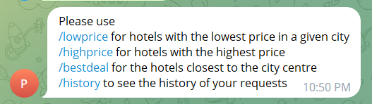
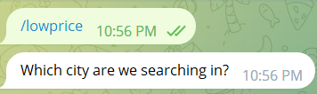
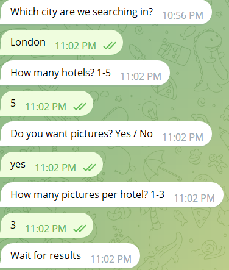
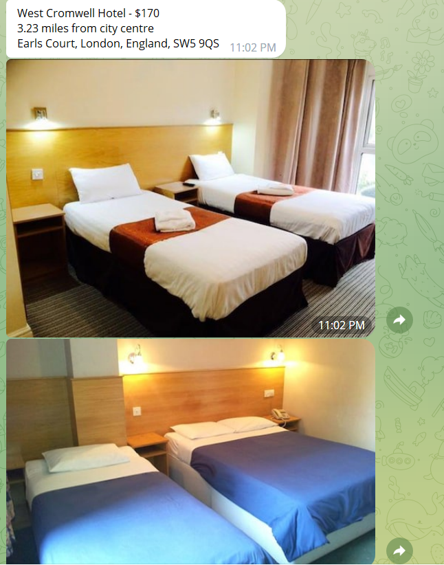
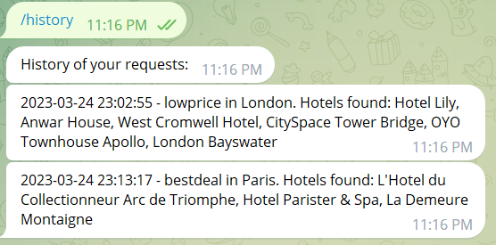

# Telegram hotel search bot

Bot link: https://t.me/py_hotel_bot

## Description

* searches hotels with the lowest price
* searches hotels with the highest price
* searches hotels closest to the city centre in a given price radius
* keeps track of user requests
* provides a variety of customizable filters

## Requirements

* Python 3.7+
* [pyTelegramBotAPI](https://github.com/python-telegram-bot/python-telegram-bot) – Python Telegram Bot API
* [requests](https://github.com/psf/requests) - requests library
* [python-dotenv](https://github.com/theskumar/python-dotenv) - dotenv library for secure token storage 

## Logging requests

No external databases used. Everything is done in dictionaries inside a class object.

## Commands

* `/start` - starts the bot
* `/help` - list of commands
* `/lowprice` - hotels with the lowest price
* `/highprice` - hotels with the highest price
* `/bestdeal` - hotels closest to the city centre in a given price radius
* `/history` - personal search history

## Basic usage

Starting the bot, as well as using `/help` command at any time will shot a short list of available commands with descriptions

Once the user knows his options, they can move forward with getting the information they need.

### Cheapest hotels

1. Starts with the input of  `/lowprice`. After that the bot will ask for a location to perform the search in.

2. After the city input, the bot will ask for the number of hotels, if the user needs any pictures and if they do, how many.

3. After a brief(or not so brief) delay the bot will provide the list of hotels with or without pictures as per user's request.

### Expensive hotels

1. Pretty much the same deal as above, but using the `/highprice` command that results in a list of expensive hotels.

### Best deal

1. Uses the `/bestdeal` command to initiate a similar input sequence as before.
2. Major difference is the manually set price range, whi allows for more robust a targeted search
3. The results are similar to before, but sorted by the proximity to the city centre and the user requested price range
4. If there are no properties close to the centre in a given price range, the results will prioritize the closest ones, rather than cheapest.

### History

1. The `/history` command results in a short list of previous user requests with date stamp and the search results.

### User requirements

English is preferred. While other languages might work, they might also not. The hotels.com api is fickle like that.
So it would be a great idea to stick to locations in English and responses that mirror the examples provided by the bot.